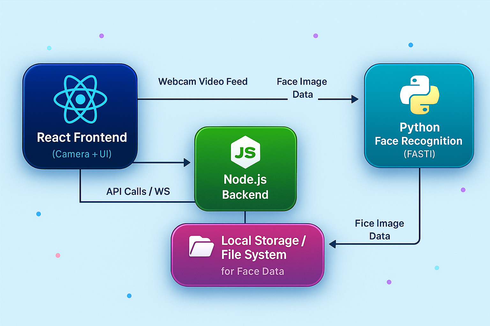

# Face Recognition Platform with Real-Time AI Q&A using RAG
# FaceIQ - Automatic Face Recognition Web App

## 🚀 Overview

**FaceIQ** is a cutting-edge face recognition web application that uses a live webcam feed to automatically detect and identify faces in real-time. It draws bounding boxes and labels with names on detected faces without any manual button clicks or interaction. The platform also supports integration with a real-time AI Q&A system using Retrieval-Augmented Generation (RAG).

---

## 🧠 Architecture Diagram



> **Note:** The above diagram illustrates the overall architecture of FaceIQ, showcasing interactions between the React frontend (camera UI), Node.js backend (API/WebSocket server), and Python-based face recognition engine (FastAPI). The face data is stored locally using formats like Pickle or JSON.

---

## 📹 Demo Video

🎥 **Watch the live demo:**  
[](https://kumaragurudtsteam-my.sharepoint.com/:v:/g/personal/eraianbu_22ad_kct_ac_in/EREczrtOpEtJt89w53IznCoBV29cTzJhAH3HAmtrI6TUng?e=IORKHF)


---

## 🛠️ How to Run Locally

Follow these steps to set up the project on your machine:

### 🔁 Clone the Repository
```bash
git clone https://github.com/your-username/Face-Recognition-Platform-with-RealTime-AI-Q-A-using-RAG.git
cd Face-Recognition-Platform-with-RealTime-AI-Q-A-using-RAG
```

### 📦 Install Frontend & Backend Dependencies
```bash
# Frontend (React)
cd client
npm install

# Backend (Node.js)
cd ../server
npm install
```

### 🧪 Set Up Python Environment for Face Recognition

1. Create a virtual environment (Python 3.10.13 recommended):
   ```bash
   python -m venv venv
   ```
2. Activate the virtual environment:
   - **Windows CMD**: `venv\Scripts\activate`
   - **PowerShell**: `.env\Scripts\Activate.ps1`
   - **Git Bash/Linux/Mac**: `source venv/Scripts/activate`
3. Install required packages:
   ```bash
   pip install -r requirements.txt
   ```

> ⚠️ **Note**: `dlib` may require Python 3.10.13 or older for compatibility.

---

### ▶️ Start the App

1. Start the backend server:
   ```bash
   node index.js
   ```

2. Start the frontend server:
   ```bash
   cd client
   $env:NODE_OPTIONS="--openssl-legacy-provider"
   npm start
   ```

3. Open your browser and navigate to `http://localhost:3000`
4. Allow webcam access when prompted.

---

## 📬 Contact

Have questions or need support?  
📧 [eraianbu873@gmail.com](mailto:eraianbu873@gmail.com)  
🌐 [https://eraianbu.pages.dev](https://eraianbu.pages.dev)
